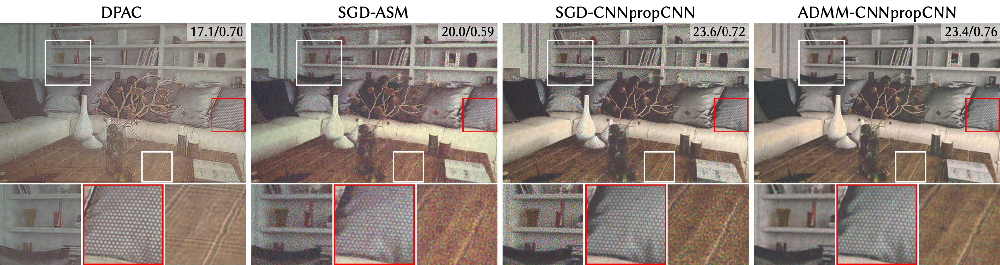
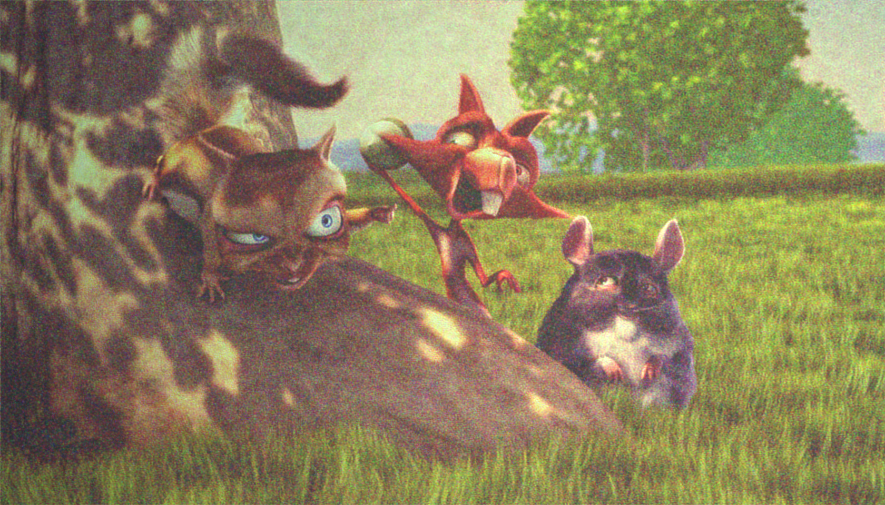
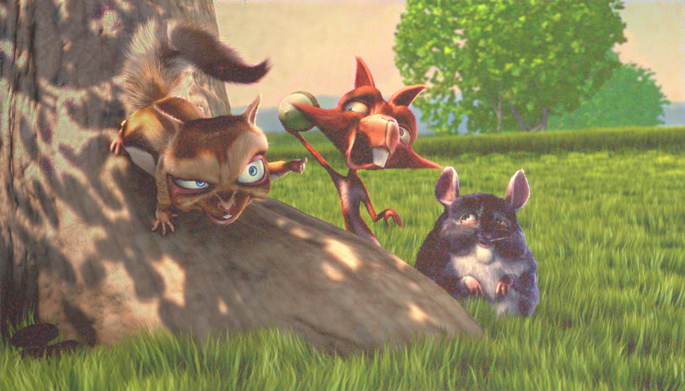
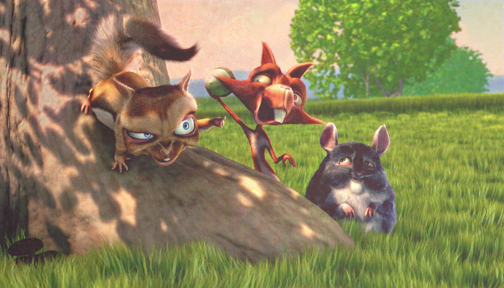

# Neural 3D holography: Learning accurate wave propagation models for 3D holographic virtual and augmented reality displays <br> SIGGRAPH Asia 2021
### [Project Page](http://www.computationalimaging.org/publications/neuralholography3d/) | [Video](https://www.youtube.com/watch?v=EsxGnUd8Efs) | [Paper](https://www.computationalimaging.org/wp-content/uploads/2021/08/NeuralHolography3D.pdf)
PyTorch implementation of <br>
[Neural 3D holography: Learning accurate wave propagation models for 3D holographic virtual and augmented reality displays](http://www.computationalimaging.org/publications/neuralholography3d/)<br>
 [Suyeon Choi](http://stanford.edu/~suyeon/)\*,
 [Manu Gopakumar](https://www.linkedin.com/in/manu-gopakumar-25032412b/)\*,
 [Yifan Peng](http://web.stanford.edu/~evanpeng/),
 [Jonghyun Kim](http://j-kim.kr/),
 [Gordon Wetzstein](https://computationalimaging.org)<br>
  \*denotes equal contribution  
in SIGGRAPH Asia 2021



## Get started
Our code uses [PyTorch Lightning](https://www.pytorchlightning.ai/) and PyTorch >=1.10.0, as it uses complex value operations

You can set up a conda environment with all dependencies like so:
```
conda env create -f env.yml
conda activate neural3d
```

Also, download [PyCapture2 SDK](https://www.flir.com/products/flycapture-sdk/) and [HOLOEYE SDK](https://holoeye.com/spatial-light-modulators/slm-software/slm-display-sdk/) (or use [slmPy](https://github.com/wavefrontshaping/slmPy)) and place the SDKs in your environment folder. If your hardware setup (SLM, Camera, Laser) is different from ours, you need to make sure that their Python API works well in the ```prop_physical.py```.

## High-Level structure

The code is organized as follows:


`./`
* ```main.py``` generates phase patterns from RGBD/RGB data using SGD.
* ```train.py``` trains parameterized propagation models from captured data at multiple planes.
* ```algorithms.py``` contains the gradient-descent based algorithm for RGBD/RGB supervision


* ```props_*.py``` contain the wave propagation operators (in simulation and physics).
* ```utils.py``` has some utils.
* ```params.py``` contains our default parameter settings. :heavy_exclamation_mark:**(Replace values here with those in your setup.)**:heavy_exclamation_mark:
* ```image_loader.py``` contains data loader modules.

`./hw/` contains modules for hardware control and homography calibration.

## Step-by-step instructions
### 0. Set up parameters 
First off, update the values in ``` params.py ``` such that all of them match your configuration (wavelength, propagation distances, the resolution of SLM, encoding for SLM, etc ...). And then, you're ready to use our codebase for your setup! Let's quickly test it by running the naive SGD algorithm with the following command: 
```
# Run naive SGD
c=1; i=0; your_out_path=./results_first;

# RGB supervision
python main.py --data_path=./data/test/rgb --out_path=${your_out_path} --channel=$c --target=rgb --loss_func=l2 --lr=0.01 --num_iters=1000 --eval_plane_idx=$i

# RGBD supervision
python main.py --data_path=./data/test --out_path=${your_out_path} --channel=$c --target=rgbd --loss_func=l2 --lr=0.01 --num_iters=1000

```
This will generate an SLM phase pattern in ```${your_out_path}```. Display it on your SLM and check out the holographic image formed. While you will get an almost flawless image in your simulation, unfortunately, you will probably get an imagery like below in your experimental setup. Here we show a captured image from our setup:


This image degradation is primarily due to the model mismatch between the simulated model you just used (ASM) and the actual propagation in the physical setup. To reduce the gap, we had proposed the "camera-in-the-loop" (CITL) optimization technique which we will try next!

### 1. Camera-in-the-loop calibration
To run the CITL optimization, we first need to align the target plane captured through the sensor with the rectified simulated coordinate. To this end, we calculate a homography between the two planes, after displaying a dot pattern (Note that you can use your own image for calibration!) at the target plane. Note that you need to do this procedure per plane. You can generate the SLM patterns for that with the following command (pass the index of the plane with ```--eval_plane_idx=$i``` for multiple planes): 

```
# Generate homography calibration patterns
python main.py --data_path=./data/calib --out_path=./calibration --channel=$c --target=2d --loss_func=l2 --eval_plane_idx=$i --full_roi=True

```
Now you're ready to run the camera-in-the-loop optimization! Before that, please make sure that all of your hardware components are ready and parameters are correctly set in ```hw_params()``` in ```params.py```. For example, you need to set up the python APIs of your SLM/sensor to run them "in-the-loop". For more information, check out the supplements of our papers: [[link1]](https://drive.google.com/file/d/1vay4xeg5iC7y8CLWR6nQEWe3mjBuqCWB/view) [[link2]](https://opg.optica.org/optica/viewmedia.cfm?uri=optica-8-2-143&seq=s001) [[link3]](https://drive.google.com/file/d/1FNSXBYivIN9hqDUxzUIMgSFVKJKtFEOr/view)
```
# Camera-in-the-loop optimization
python main.py --citl=True --data_path=./data/test --out_path=${your_out_path} --channel=$c --target=2d --loss_func=l2 --eval_plane_idx=$i

```
With the phase pattern generated by this code, you will get experimental results like below:



### 2. Forward model training
Although the camera-in-the-loop shows a significant improvement over the naive approaches, still it has limitations in the need for a camera for every iteration and target image which may not be practical, and also it is hard to extend to 3D since you will need to change the focus of the lens every iteration. To overcome the limitation, we proposed to train a parameterized wave propagation model instead of optimizing a single-phase pattern. After training once, you can use this model to either optimize a phase pattern for 3D or use it as a loss function for training an inverse network.

#### 2-1. Dataset generation
To train the model, we first create a set of thousands of phase patterns that are various in randomness, target image, number of iterations, method, etc. 
For dataset images, we used the [DIV2K dataset](https://data.vision.ee.ethz.ch/cvl/DIV2K/) for our training - you can also download put them in your ```${data_path}```.

```
python main.py --prop_model=${model} --data_path=${data_path} --out_path=${out_path} --channel=$c --target=2d --loss_func=l2 --prop_model_path=${model_path} --random_gen=True

```

#### 2-2. Dataset capture
Then, let's display and massively capture all of them for all planes.
```
for i in 0 1 ... 7
do
python dataset_capture.py --channel=$c --plane_idx=i
done
```
We also release a subset of our dataset which you can download from here: [[Big Dataset (~220GB)]](https://drive.google.com/file/d/1E9ppFPwueGwRTG9yRk9wbB3Xy7eOOGOI/view?usp=sharing), [[Small Dataset (~60GB)]](https://drive.google.com/file/d/1EC2pzHlsB_P_braGc1r71oKt9vlmwzlq/view?usp=sharing)..
#### 2-3. Forward model training
With thousands of pairs of `(phase pattern, captured intensities)`, now you can train any parameterized model letting them to predict the intensities at multiple planes. We implemented several architectures for the models described in our paper, the original [Neural Holography](https://www.computationalimaging.org/publications/neuralholography/) model, Hardware-in-the-loop model (Chakravathula et al., 2020), and three variants of our [NH3D](https://www.computationalimaging.org/publications/neuralholography3d/) model (CNNprop, propCNN, CNNpropCNN).
Train the Neural Holography models (SIGGRAPH Asia 2020, 2021) with the same codebase!
```
# try nh, hil, cnnprop, propcnn, cnnpropcnn for ${model}.
python train.py --prop_model=${model} --data_path=${data_path} --out_path=${out_path} --channel=${channel} --lr=4e-4 --num_train_planes=${num_train_planes}
```

Repeat the procedures from 2-1. to 2.3 using your trained model. 

#### 2-4. Run SGD-Model (with the trained forward model)
After training, simply run the phase generation script you ran at the [beginning](#step-by-step-instructions), adding a pointer of your trained model `${model_path}`.
```
# RGB
python main.py --prop_model=${model} --data_path=${data_path} --out_path=${out_path} --channel=$c --target=2d --loss_func=l2 --prop_model_path=${model_path} --eval_plane_idx=$i

# RGBD supervision
python main.py --prop_model=${model} --data_path=${data_path} --out_path=${out_path} --channel=$c --target=rgbd --loss_func=l2 --prop_model_path=${model_path}
```

Using the command above, we can now achieve a holographic image like below in the same setup. Please try RGBD supervision and other methods we discuss in our paper!


### Citation
If you find our work useful in your research, please cite:
```
@article{choi2021neural,
  title={Neural 3D holography: Learning accurate wave propagation models for 3D holographic virtual and augmented reality displays},
  author={Choi, Suyeon and Gopakumar, Manu and Peng, Yifan and Kim, Jonghyun and Wetzstein, Gordon},
  journal={ACM Transactions on Graphics (TOG)},
  volume={40},
  number={6},
  pages={1--12},
  year={2021},
  publisher={ACM New York, NY, USA}
}
```

### Contact
If you have any questions, please email Suyeon Choi at suyeon@stanford.edu.
